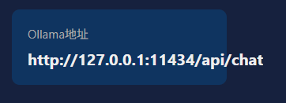

**警告：这是一个预发布版本（beta)**  
本版本仅供测试和反馈使用，软件尚不稳定，可能存在数据丢失或崩溃的风险。请勿在生产环境中使用

## 用途  
用来对接Ollama和QQ机器人

## 已知问题  
**严重** :暂未发现  
**中等** :在没有任何对话的前提下，程序会每30分钟自动断开并重连一次，每2个小时会高频出现"Token即将过期，开始刷新..."和"Token已刷新"字样，最后报错4009断开并自动重连后恢复正常（以下下为部分日志截图）  
  
**轻微** :  
1.在后台管理网站中会出现文字和按钮不在同一行上的问题（如图所示）  
  
2.在后台管理网站中的运行状态一栏会出现单条数据过长超出方框的问题（比如Ollama地址一栏）  

**可能还有部分问题作者在测试中没有发现，如果各位还发现什么已知问题，可以通过在 GitHub 上创建 Issue 来报告 Bug**  

## 注意事项  
1.如要运行源码，请确保您以安装python3.13,python第三方依赖（ aiohttp，websockets，cryptography ）与Ollama  
（ python3.13下载地址:https://www.python.org/downloads/release/python-31314/ )  
（ Python第三方依赖安装方法：在cmd中输入:pip install aiohttp websockets cryptography ）  
（ Ollama安装包下载地址:https://ollama.com/ ）  
2.目前该程序还未进行任何兼容性测试，无法保证程序在任何环境中都能正常运行（建议使用Windows10/Windows11）

## AI生产免责声明  
**注意**:本软件是用AI工具创建的。尽管我以尽力确保其功能正常，但代码按原样提供，不提供任何形式的保证  
**AI局限性**:用户应知晓，AI生成的代码可能包含未经过全面审计的安全漏洞或逻辑错误  
本项目目前并不稳定，且包含已知Bug，使用风险自负

不过我还是非常欢迎大家提交代码，来修复AI犯下的错误

## 安装与使用  
**该方法适用于Windows平台**  
1.访问QQ开放平台（ https://q.qq.com/#/ ）注册并登录账号  
2.在页面左侧点击“机器人”，再点击页面中间的“去创建或管理我的QQ机器人  
3.在页面右上角点击“创建机器人”，并按提示创建机器人账号  
4.在“设置AI服务”中点击页面右上角的“稍后连接”  
5.在当前页面选择你所创建的机器人  
7.安装Ollama  
6.选择“开发设置”，记下右侧的AppID和AppSecret  
8.下载Release中的QQBot.zip并解压到任意目录，保证压缩包中的文件在同一目录下  
9.双击运行其中的main.exe，首次运行会创建以下文件：  
-logs:日志存放地址  
-.privacy_key:存放上下文加密密钥，如果该文件丢失则历史对话全部无法解密  
-config.json:项目唯一核心配置文件  
-config配置说明.txt:对config.json中的每一项配置的解释说明  
-contexts.json:存储所有用户的对话上下文记录  
10.打开config.json，填写刚才记下的AppID和AppSecret，并填写Ollama默认使用的模型  
11.运行Ollama程序或在cmd窗口中运行:ollama serve  
12.再次双击运行main.exe,如填写均正确控制台会显示“✅ 机器人已上线！ID：123***1234”字样  
注：如需填写管理员OpenID，可通过QQ向该机器人发送消息，之后就能在控制台的用户后面找到一串由数字和字母组成的用户标签，复制这标签填写到config.json中的ADMIN_IDS即可
